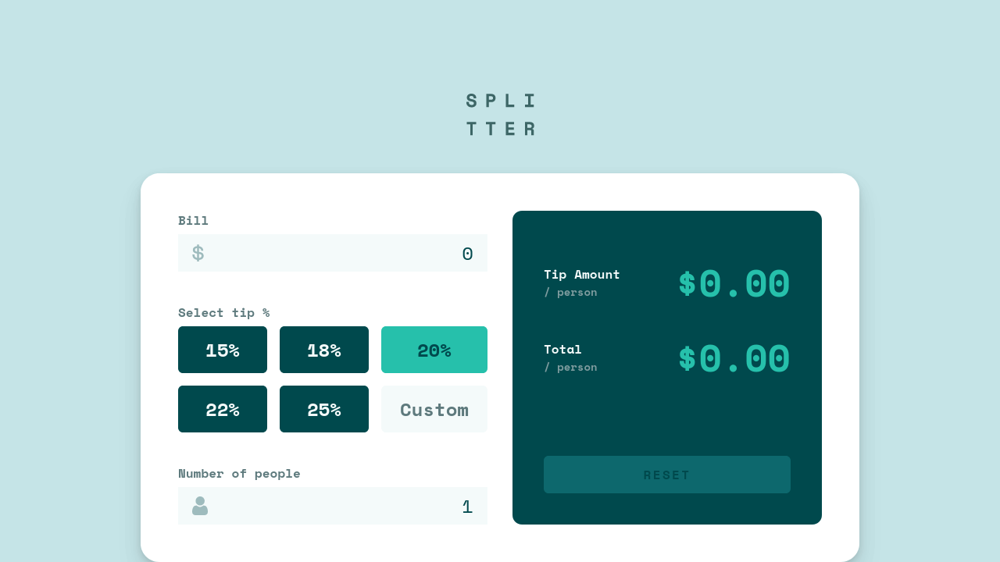
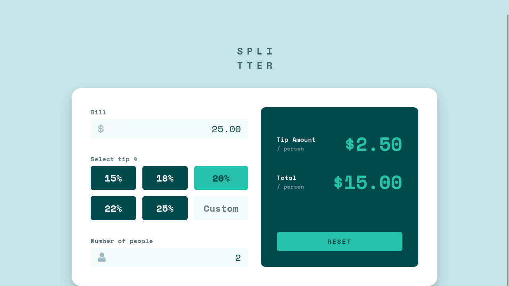

# Splitter - Tip Calculator App

This is a solution to the [Tip calculator app challenge on Frontend Mentor](https://www.frontendmentor.io/challenges/tip-calculator-app-ugJNGbJUX) as the test task for Datarockets.

## Table of contents

- [Description](#description)
- [Built with](#built-with)
- [Author](#author)

## Description

Splitter is a tip calculator web app.

 

Users can enter a bill amount, tip percent, and split number, and the app will automatically display the tip amount and total per person.

 

## Built with

- [React](https://reactjs.org/)
- CSS Modules
- NodeJS v15.14.0

## Author

**Andrew Lupin**

- [GitHub Profile](https://github.com/AndrewLupin1106)
- [Email](andrewlupin1106@gmail.com)
- [Telegram](https://t.me/pollo_dev)

